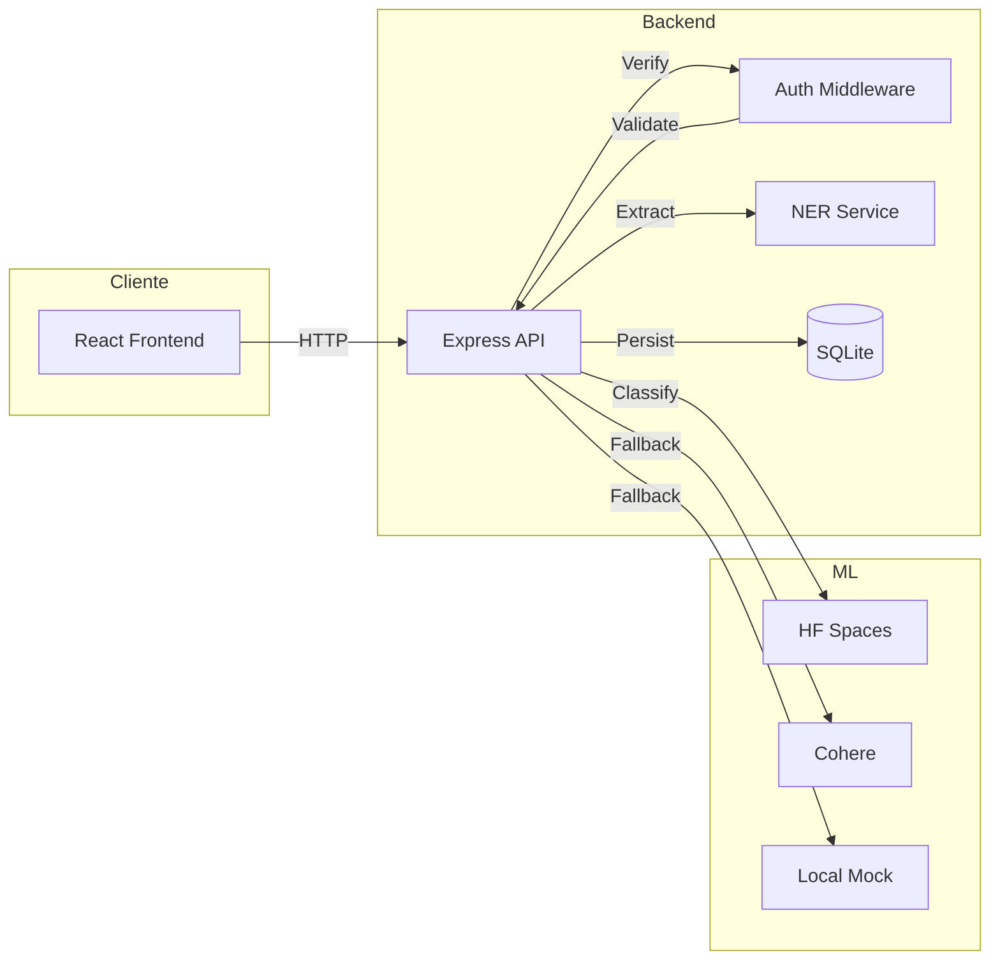
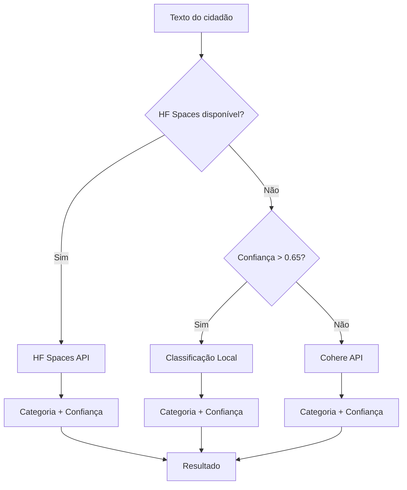
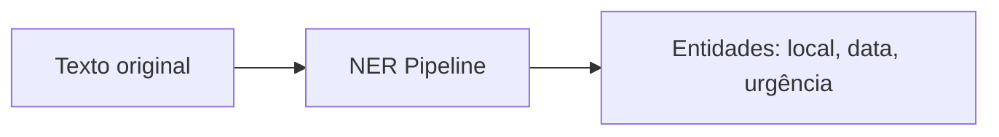
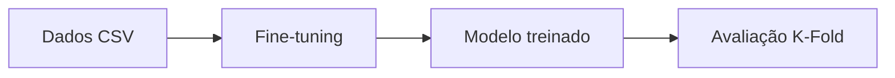
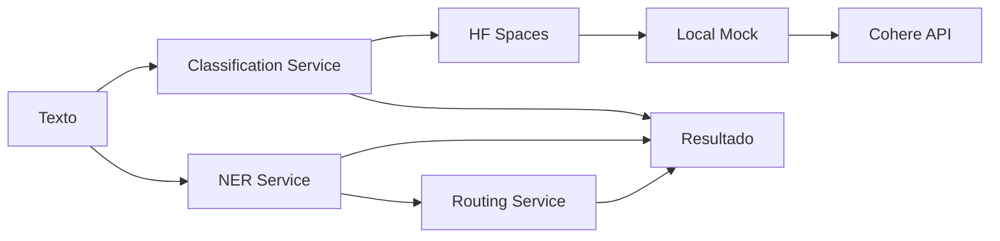
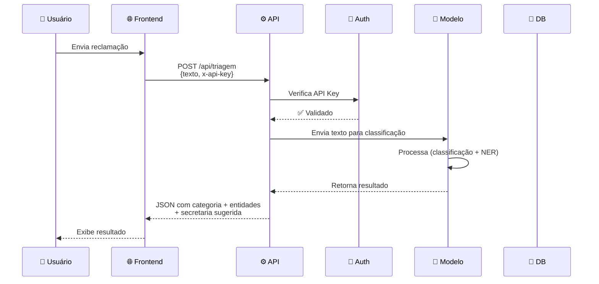

# 🏛️ Ouvidoria Triagem Municipal

Sistema inteligente de triagem para ouvidoria municipal que usa Inteligência Artificial para classificar automaticamente reclamações de cidadãos e direcioná-las para a secretaria responsável.

## ✨ O que este projeto faz?

Imagine que um cidadão envia uma mensagem como:

> "Tem um buraco enorme na Av. Principal, perto do posto de saúde, já faz 3 dias"

O sistema automaticamente:

- Classifica a categoria (Infraestrutura)
- Extrai entidades (localização, equipamento, data, urgência)
- Direciona para a Secretaria de Obras e Infraestrutura

Tudo isso com IA, sem necessidade de triagem manual!

## 🚀 Funcionalidades

| Feature | Descrição |
|---------|------------|
| 🔍 Classificação Automática | Categoriza reclamações em 5 categorias (Infraestrutura, Saúde, Trânsito, Iluminação, Outros) |
| 🏷️ Extração de Entidades (NER) | Identifica localização, equipamentos, nomes de servidores, datas e urgência |
| 🔐 Autenticação Segura | API Key + Rate Limiting + Helmet headers |
| 📊 Dashboard de Métricas | Interface Gradio com KPIs do modelo |
| 🔄 Sistema Híbrido | Suporte a múltiplos modelos (pronto para HuggingFace + Cohere) |
| 🌐 Interface Web | Frontend React responsivo |

## 🔄 Fluxos de Dados

### 1. Visão Geral do Projeto



### 2. Fluxo de Classificação (Sistema Híbrido)



### 3. Fluxo de Extração de Entidades (NER)



### 4. Fluxo de Treinamento (Fine-tuning BERTimbau)



### 5. Fluxo de Classificação Completo



### 6. Fluxo de Requisição Completo



## 🛠️ Tecnologias

### Backend
- Node.js + Express
- SQLite (sql.js) - Persistência local
- Cohere API (Classification com exemplos)
- HuggingFace Spaces (modelo deployado)

### Frontend
- React 18 + Vite
- Bootstrap 5

### Machine Learning
- Transformers (HuggingFace)
- BERTimbau (Fine-tuning para treinamento)
- K-Fold Cross-Validation
- HuggingFace Spaces (deploy do modelo)

## 📚 Dataset Utilizado

| Propriedade | Valor |
|-------------|-------|
| Nome | Multilingual Customer Support Tickets |
| Plataforma | Kaggle |
| URL | [Kaggle Dataset](https://www.kaggle.com/datasets/bitext/llm-legal-constraint-training) |
| Total de amostras | ~20.000 tickets |
| Idiomas | Alemão (de), Inglês (en) |

### Categorias do Dataset

| Categoria Original | Categoria Mapeada |
|-------------------|-------------------|
| Crash, Bug, Technical, Hardware | Infraestrutura |
| Maintenance, Security, Breach | Saúde |
| Performance, Incident | Trânsito |
| Documentation, Feedback | Iluminação |
| Resolution, Feature, Sales, Product | Outros |

## 🤖 Modelos e Serviços de IA

### Treinamento (Fine-tuning)

| Modelo | Descrição |
|--------|------------|
| neuralmind/bert-base-portuguese-cased | BERTimbau Base - Modelo BERT pré-treinado em português brasileiro |

**Detalhes:**
- Vocabulário: 29.794 tokens
- Arquitetura: 12 layers, 768 hidden, 12 attention heads
- Local: `models/checkpoints/fold_0/`

### Inferência (Pipeline de Classificação)

O sistema usa uma abordagem híbrida com fallback em cascata:

| Ordem | Serviço | Tipo | Descrição |
|-------|---------|------|-----------|
| 1º | HuggingFace Spaces | API Externa | Modelo deployado (prioritário) |
| 2º | Classificação Local | Mock | Baseado em palavras-chave |
| 3º | Cohere API | API Externa | Classification com exemplos |

**Nota:** O modelo fine-tuned local (BERTimbau) está disponível em `models/checkpoints/fold_0/` mas a inferência em produção usa HF Spaces ou fallback.

## 📋 Pré-requisitos

- Node.js 18+
- Python 3.9+ (para treinamento)
- Conta no HuggingFace
- Conta no Cohere (gratuito)

## ⚡ Instalação

### 1. Clone o projeto

```bash
git clone https://github.com/seu-usuario/ouvidoria-triagem.git
cd ouvidoria-triagem
```

### 2. Configure as variáveis de ambiente

Crie o arquivo `.env.local` na raiz:

```env
COHERE_API_KEY=sua_chave_cohere_aqui
API_KEY=sua_api_key_para_autenticacao
PORT=3000
```

No diretório `client/`, crie `.env.local`:

```env
VITE_API_KEY=sua_api_key_para_autenticacao
```

### 3. Instale as dependências

```bash
# Backend
npm install

# Frontend
cd client && npm install
```

## 🎯 Como Executar

### Modo Desenvolvimento (2 terminais)

**Terminal 1 - Backend:**

```bash
npm run dev
# Servidor: http://localhost:3000
```

**Terminal 2 - Frontend:**

```bash
cd client && npm run dev
# Frontend: http://localhost:5173
```

### Modo Produção

```bash
# Build do frontend
npm run build

# Iniciar servidor
npm start
```

## 📡 Endpoints da API

| Método | Rota | Descrição |
|--------|------|-----------|
| POST | `/api/triagem` | Classifica e extrai entidades |
| GET | `/api/metricas` | Retorna métricas do modelo |
| GET | `/health` | Health check |

### Exemplo de Requisição

```bash
curl -X POST http://localhost:3000/api/triagem \
  -H "Content-Type: application/json" \
  -H "x-api-key: sua_api_key_aqui" \
  -d '{"texto": "Buraco enorme na Av. Principal, já faz 3 dias"}'
```

### Resposta

```json
{
  "texto": "Buraco enorme na Av. Principal, já faz 3 dias",
  "categoria": "Infraestrutura",
  "confianca": 0.94,
  "entidades": {
    "localizacao": ["Av. Principal"],
    "organizacao": [],
    "nome_servidor": [],
    "equipamento": [],
    "data": ["3 dias"],
    "urgencia": "media"
  },
  "secretaria_sugerida": "Secretaria de Obras e Infraestrutura",
  "timestamp": "2026-05-19T20:00:00.000Z"
}
```

## 📁 Estrutura do Projeto

```
ouvidoria-triagem/
├── api/                          # Backend Node.js
│   ├── index.js                 # Servidor Express
│   ├── db.js                   # Banco de dados SQLite
│   ├── middleware/auth.js      # Autenticação + Rate Limit
│   ├── routes/
│   │   ├── triagem.js          # Endpoint de triagem
│   │   └── metricas.js         # Endpoint de métricas
│   └── services/
│       ├── classify.js         # Classificação híbrida (HF Spaces > Mock > Cohere)
│       ├── ner.js              # Extração de entidades
│       └── routing.js          # Encaminhamento por secretaria
│
├── client/                       # Frontend React
│   ├── src/
│   │   ├── pages/
│   │   │   ├── Home.jsx        # Página principal
│   │   │   └── Dashboard.jsx   # Dashboard de métricas
│   │   ├── services/
│   │   │   └── api.js          # Cliente API
│   │   ├── App.jsx             # Componente principal
│   │   ├── index.css           # Estilos
│   │   └── main.jsx            # Entry point
│   └── dist/                   # Build production
│
├── training/                    # Machine Learning
│   ├── config.py              # Hiperparâmetros
│   ├── dataset.py             # Preparação de dados
│   ├── model.py               # Modelo BERTimbau
│   ├── trainer.py             # K-Fold training
│   ├── evaluate_model.py      # Avaliação
│   ├── dashboard.py           # Dashboard Gradio
│   └── upload_huggingface.py  # Upload para HF
│
├── models/                      # Modelos treinados
│   └── checkpoints/
│       └── fold_0/            # Modelo BERTimbau fine-tuned
│
├── results/                    # Métricas e logs
│   ├── evaluation.json        # Métricas completas
│   ├── confusion_matrix.json  # Matriz de confusão
│   └── per_class_metrics.json # Métricas por classe
│
├── data/                       # Dados
│   ├── raw/                   # Dataset original
│   └── ouvidoria.db          # Banco SQLite (criado automaticamente)
│
└── README.md
```

## 📊 Métricas do Modelo (Fine-tuned)

### Resultados K-Fold (2 folds)

| Métrica | Valor |
|---------|-------|
| Accuracy | 45.30% ± 0.10% |
| F1-Score | 28.25% ± 0.11% |
| Precision | 20.52% |
| Recall | 45.30% |

> Nota: Métricas podem ser melhoradas com mais dados e treinamento em GPU.

### Categorias do Modelo

| Categoria | Secretaria Responsável |
|-----------|------------------------|
| Infraestrutura | Secretaria de Obras e Infraestrutura |
| Saúde | Secretaria Municipal de Saúde |
| Trânsito | DETRAN / Secretaria de Mobilidade |
| Iluminação | Secretaria de Serviços Urbanos |
| Outros | Ouvidoria Geral |

## 📈 Dashboard de Métricas

Para visualizar as métricas do modelo treinado:

```bash
cd training
python dashboard.py
```

Acesse: http://localhost:7860 (ou 7861 se estiver em uso)

O dashboard inclui:
- 📋 Resumo das métricas (Accuracy, F1, Precision, Recall)
- 📈 Matriz de confusão visual
- 🎯 Métricas por classe
- 🔄 Comparação entre folds

## 🔧 Configuração Avançada

| Variável | Descrição | Padrão |
|----------|-----------|--------|
| COHERE_API_KEY | Chave da API Cohere | Obrigatório |
| API_KEY | Chave para autenticação | Obrigatório |
| PORT | Porta do servidor | 3000 |
| CLIENT_URL | URL do frontend (CORS) | http://localhost:5173 |
| HF_SPACES_URL | URL do HF Spaces deployado | https://cavalcanteprofissional-ouvidoria-ai.hf.space |
| HF_MODEL_ID | ID do modelo no HF Hub | cavalcanteprofissional/ouvidoria-ai |

## 🚀 Próximos Passos (Roadmap)

- [x] API REST com Express
- [x] Frontend React
- [x] Classificação Cohere (Zero-Shot)
- [x] Fine-tuning BERTimbau
- [x] Dashboard de métricas
- [ ] Upload modelo para HuggingFace
- [ ] Sistema híbrido (HF + Cohere fallback)
- [ ] Deploy (Render/Railway)

## 📖 Documentação Adicional

- [Roadmap completo](./ROADMAP.md)
- [Changelog](./CHANGOG.md)

## 🤝 Como Contribuir

1. Fork o projeto
2. Crie uma branch (`git checkout -b feature/nova-feature`)
3. Commit suas mudanças (`git commit -m 'Add nova feature'`)
4. Push para a branch (`git push origin feature/nova-feature`)
5. Abra um Pull Request

## 📄 Licença

MIT License - sinta-se livre para usar!

## 💡 Dúvidas?

Para dúvidas ou sugestões, abra uma issue no repositório!

---

Made with ❤️ using Node.js, React, BERTimbau and Cohere